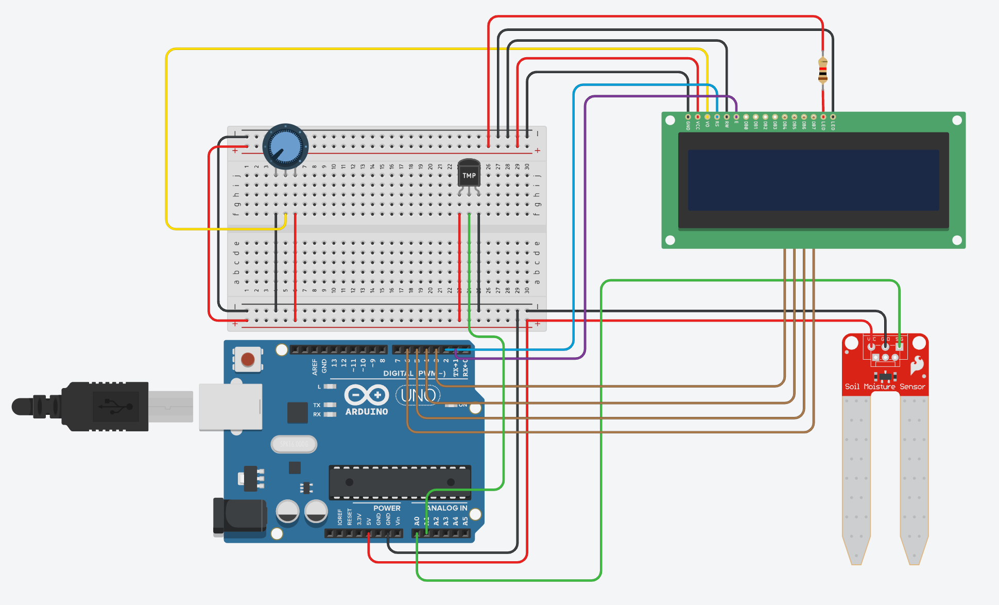

<h1 align="center">Projeto Smart Grennhouse</h1>

<br>

## 💻 Objetivo do projeto

O objetivo deste projeto é criar uma estufa automatizada capaz de monitorar e ajustar as condições ambientais para o cultivo eficiente de plantas e ervas. A estufa utiliza sensores para medir a temperatura, umidade do solo, iluminação e peso das plantas, proporcionando um ambiente controlado e otimizado para o crescimento das plantas.

## 🛠️ Componentes utilizados

- <b>Arduino Uno:</b> Microcontrolador utilizado para gerenciar os sensores e exibir informações.
- <b>Display LCD:</b> Utilizado para exibir as informações dos sensores.
- <b>Sensor de Umidade do Solo:</b> Mede a quantidade de água no solo.
- <b>Sensor de Temperatura (LM35):</b> Mede a temperatura ambiente.
- <b>Sensor de Iluminação (LDR):</b> Mede a intensidade da luz na estufa (não incluído no circuito atual).
- <b>Sensor de Peso (Célula de Carga)</b> Mede o peso das plantas para monitorar seu crescimento (não incluído no circuito atual).

## 🔖 Layout

<p align="center">
  
</p>

## 🔗 Link do projeto

[Clique aqui para acessar](https://www.tinkercad.com/things/hnjr3BZHMNX-sensores-pi?sharecode=wQxRZTj_3Ax0QL8Z1QjVxrqPdnxXs-nKy0ILVEQ48lM)

<br>

<h1 align="center">Esquemático do Circuito</h1>
<br>

## 📍 Código do Projeto

```
#include <LiquidCrystal.h>

// Pinos do display LCD: RS, E, D4, D5, D6, D7
LiquidCrystal lcd(2, 1, 3, 4, 5, 6);

// Pinos analógicos dos sensores
const int soilSensorPin = A0;
const int tempSensorPin = A1;

// Variáveis para armazenar os valores de leitura
int soilMoistureValue = 0;
int soilMoisturePercent = 0;
int tempValue = 0;
float temperatureC = 0;

void setup() {
  // Configuração do display LCD
  lcd.begin(16, 2);

  // Exibir os textos fixos
  lcd.setCursor(0, 0);
  lcd.print("Umidade: ");
  lcd.setCursor(0, 1);
  lcd.print("Temp: ");

  // Configuração dos pinos dos sensores como entrada
  pinMode(soilSensorPin, INPUT);
  pinMode(tempSensorPin, INPUT);
}

void loop() {
  // Leitura do valor do sensor de umidade
  soilMoistureValue = analogRead(soilSensorPin);
  
  // Converte o valor lido em porcentagem
  // Supondo que o valor máximo de umidade é 870 e o mínimo é 0
  soilMoisturePercent = map(soilMoistureValue, 0, 870, 0, 100);

  // Leitura do valor do sensor de temperatura
  tempValue = analogRead(tempSensorPin);
  
  // Converte o valor lido para temperatura em Celsius
  // A fórmula para o LM35 é: (Vout / 1024 * 5) * 100
  temperatureC = (tempValue / 1024.0) * 500.0;

  // Exibir a porcentagem de umidade no display LCD
  lcd.setCursor(9, 0);
  lcd.print(soilMoisturePercent);
  lcd.print("%");
  lcd.print("  ");  // Espaços em branco para limpar valores anteriores
  
  // Exibir a temperatura no display LCD
  lcd.setCursor(6, 1);
  lcd.print(temperatureC);
  lcd.print("C");
  lcd.print("  ");  // Espaços em branco para limpar valores anteriores

  // Atraso de meio segundo para a próxima leitura
  delay(500);
}
```

## 🔋 Funcionamento dos Sensores

### Sensor de Umidade do Solo
- O sensor de umidade do solo mede a quantidade de água presente no solo. O valor lido pelo sensor é convertido em uma porcentagem, que é exibida no display LCD. Este sensor ajuda a garantir que as plantas recebam a quantidade adequada de água.

### Sensor de Temperatura (LM35)
- O sensor de temperatura LM35 mede a temperatura ambiente. O valor lido é convertido em graus Celsius e exibido no display LCD. Manter a temperatura adequada é crucial para o crescimento saudável das plantas.

### Sensor de Iluminação (LDR)
- O sensor de iluminação, utilizando uma LDR (Light Dependent Resistor), mede a intensidade da luz recebida pelas plantas. Este sensor pode ser utilizado para controlar sistemas de iluminação artificial, garantindo que as plantas recebam a quantidade correta de luz.

### Sensor de Peso (Célula de Carga)
- O sensor de peso mede o peso das plantas, o que pode ser usado para monitorar o crescimento ao longo do tempo. Este sensor é útil para detectar se as plantas estão crescendo conforme o esperado ou se necessitam de atenção adicional

<br>

## 📝 Considerações Finais

Este projeto de "estufa inteligente" oferece uma solução automatizada e eficiente para o cultivo de plantas, utilizando uma série de sensores para monitorar e controlar as condições ambientais de forma precisa.

Com esses sensores integrados, nossa estufa inteligente não apenas monitora, mas também ajusta as condições ambientais em tempo real, criando um ambiente ideal para o cultivo eficiente e saudável de plantas e ervas. Este projeto demonstra como a tecnologia IoT pode ser aplicada na agricultura para melhorar a produtividade e a sustentabilidade.