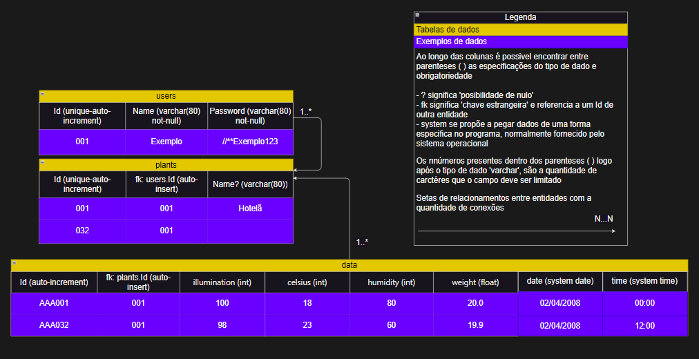

# ABOUT OUR PROJECT

Name: _"Smart Greenhouse"_

Description: _"We aim to apply simplicity in planting small herbs with technology."_

Data to be collected:

- Light level
- Soil moisture
- Plant weight
- Ambient temperature

> [!NOTE]
> We will compare plant development data with an API that provides data on ideal environments for each type of plant.

***

## Technologies:

|               |                                                                              |
| ------------- | ---------------------------------------------------------------------------- |
| React         | Web Development                                                              |
| React Native  | Mobile Development                                                           |
| Tinker Cat    | Arduino Development (we will try to use it for simulations)                  |
| API           | Service providing data on ideal environments for cultivating diverse plants  |
| Database      | NoSQL MongoDB (or a simpler database like SQL SQLite)                        |
| Redash        | Website (and integration tool) for creating Dashboards                       |

***

## High-Fi images:

### Versão desktop

Link de protótipo: [smart-greenhouse-desktop](https://www.figma.com/proto/4HkQCk0Tb0f7qK1p9p9lZX/Ael-Martins's-team-library?type=design&node-id=411-657&t=D4mEFMmjXQiPkr1v-0&scaling=scale-down&page-id=411%3A651)

### Versão mobile
 

Link de protótipo: [smart-greenhouse-mobile](https://www.figma.com/proto/4HkQCk0Tb0f7qK1p9p9lZX/Ael-Martins's-team-library?type=design&node-id=411-55&t=D4mEFMmjXQiPkr1v-0&scaling=scale-down&page-id=411%3A2)

## Database diagram:

***

## Participants:

[ João Pedro Borges Araújo		      | 1091392223001 ]

[ Samuel Luiz Martins dos Santos 	  | 1091392223033 ]

[ Victor Hugo Moro Pires 			  | 1091392223018 ]

[ José Gabriel Galvão Amorim		      | 1091392223030 ]
